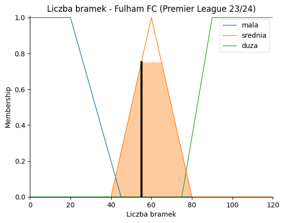

# Football Team Offensiveness Analyzer


## About project
The system is a university project implemented in a **Jupyter Notebook** environment. It aims to calculate a football team's offensiveness over the course of a season, using its data on goals scored, shots taken per game and average ball possession per game. Models use **fuzzy logic** algorithms to calculate the membership of fuzzy logic sets. The developed fuzzy inference system operates in two modes:
- processing football team data from a .csv file and calculating offensiveness based on read parameters,
- calculating offensiveness based on user-provided parameters: team name, league name, goals, shoots per game and ball possession.

## Technologies
- Tools:
     - **Google Colab** with **Jupyter Notebook**
- Programming language: 
     - **Python**
- Libraries:
     - **NumPy** - for numerical calculations,
     - **Pandas** - for data manipulation and analysis,
     - **Matplotlib** - for creating charts and data visualization,
     - **Seaborn** - for more advanced data visualizations,
     - **files** (google.colab) - to work with files in the Google Colab environment.
- Frameworks and modules:
     - **skfuzzy** - allows the use of functions for operations on fuzzy sets,
     - **control** (skfuzzy) - allows to create and control fuzzy systems.
- Technology:
     - **Fuzzy logic** - for assessing membership of fuzzy sets.
- Fuzzy inference model:
     - **Mamdani method**
- Dataset source:
     - **Kaggle** (**.csv** file)

## Example dataset
Kaggle page: https://www.kaggle.com/datasets/varpit94/football-teams-rankings-stats

## Solution
Importing data:


### Description of read data

Variable description:
- **Team** - name of the football team participating in the league,
- **Tournament** - the name of the football league,
- **Goals** - the number of goals scored by the team in the league,
- **Shots pg** - the average number of shots taken by the team per game,
- **yellow_cards** - the number of yellow cards received by the team in the league,
- **red_cards** - the number of red cards received by the team in the games,
- **Possession%** - average percentage of the team's possession of the ball in games,
- **Pass%** - the average percentage of the team's accurate passes in the games,
- **AerialsWon** - average number of duels won per game,
- **Rating** - overall team rating based on a certain website.

Input variables:
- Qualitative variables: **Team, Tournament**
- Quantitative variables: **Goals, Shots pg, yellow_card, red_cards, Possesion%, Pass%, AerialsWon, Rating**

### Data processing

It was decided to remove the variables: **yellow_cards**, **red_cards**, **Rating**, **Pass%**, **AerialsWon**, because they are not directly related to the analysis of the offensive performance of the football team. Their presence could introduce unnecessary variability that could distort the analytical model.

```bash
columns_to_drop = ['yellow_cards', 'red_cards', 'Rating', 'Pass%', 'AerialsWon']
data = data.drop(columns=columns_to_drop)
```

Therefore, for analytical purposes, variables named: **Team**, **Tournament**, **Goals**, **Shots pg**, **Possession%**. Qualitative variables were left to identify a specific record in the .csv file.

Changing the variable names to lowercase and removing the '%' character from them:

```bash
data.columns = data.columns.str.replace('%', '')
data.columns = data.columns.str.lower()
data.rename(columns={'shots pg': 'shots_per_game'}, inplace=True)
```

Re-loading column names (variables):

```bash
print(f'Kolumny: {data.columns}')
```


Rejecting outliners - eliminating unusual or invalid data that can interfere with analysis. In the context of the code, outliners were removed for variables that are out of range:
- goals: <0, 120>
- shots_per_game: <0, 30>
- possession: <0, 100>

```bash
data = data[
    (data['goals'] >= 0) & (data['goals'] <= 120) &
    (data['shots_per_game'] >= 0) & (data['shots_per_game'] <= 30) &
    (data['possession'] >= 0) & (data['possession'] <= 100)
]
```

### Feature Engineering for .csv data

Histogram for the **goals** variable:


Histogram for the **shots_per_game** variable:


Histogram for the **possession** variable:


## Problem solving - Fuzzy logic

### Fuzzy inference model - **Mamdani method**.

The Mamdani model is a qualitative way of modeling based on expert knowledge, using fuzzy rules of the form “IF (x is A1), THEN (y is B1)”, where x and y are variables, and A1 and B1 are fuzzy sets. The rules describe local relationships between variables x and y, referring to fuzzy sets in premises and conclusions.

### Creating linguistic variables

Input linguistic variables:
- Liczba bramek - **Number of goals** *(goals)*: [no unit], range from 0 to 120,
- Średnia liczba strzałów na mecz - **Average number of shots per game** *(shots_per_game)*: [no unit], range 0 to 30,
- Średni procent posiadania piłki - **Average percentage of ball possession** *(possesion)*: [%], range 0 to 100.

Output linguistic variables:
- Ofensywność drużyny - **Team Offensiveness** *(offensiveness)*: [%], range 0 to 100

```bash
goals = ctrl.Antecedent(np.arange(0, 121, 1), 'Liczba bramek')
shots_per_game = ctrl.Antecedent(np.arange(0, 30.1, 0.1), 'Średnia liczba strzałów na mecz')
possession = ctrl.Antecedent(np.arange(0, 100.1, 0.1), 'Średni procent posiadania piłki')

offensiveness = ctrl.Consequent(np.arange(0, 101, 1), 'Ofensywność drużyny', defuzzify_method='centroid')
```

### Definition of fuzzy sets and membership functions

- Number of goals (*Liczba bramek*)
  - mala - represents a small number of goals and is described by a trapezoidal function, which has a membership equal to 1 in the range from 0 to 20, and a decreasing membership from 20 to 45, outside this range is 0.
  - srednia - represents the average number of goals and is described by a triangular function, whose membership is maximum at 60 and decreases in the directions of 40 and 80.
  - duza - represents a large number of goals and is described by a trapezoidal function, which has an increasing membership from 75 to 90, a maximum from 90 to 120, and outside this range is 0.

```bash
goals['mala'] = fuzz.trapmf(goals.universe, [0, 0, 20, 45])
goals['srednia'] = fuzz.trimf(goals.universe, [40, 60, 80])
goals['duza'] = fuzz.trapmf(goals.universe, [75, 90, 120, 120])
```


- Average number of shots per match (*Średnia liczba strzałów na mecz*)
  - mala - represents the small number of shots per match and is described by a trapezoidal function, which has a membership equal to 1 in the range from 0 to 6, and then decreases to 0 in the interval from 6 to 10, outside this range is 0.
  - srednia - represents the average number of shots per match and is described by a triangular function, whose membership reaches a maximum at 14, and decreases in the directions of 9 and 20.
  - duza - represents a large number of shots per match and is described by a trapezoidal function, which starts increasing at 14, reaches a maximum between 20 and 30, and remains equal to 1 until the end of the 30 range.

```bash
shots_per_game['mala'] = fuzz.trapmf(shots_per_game.universe, [0.0, 0.0, 6.0, 10.0])
shots_per_game['srednia'] = fuzz.trimf(shots_per_game.universe, [9.0, 14.0, 20.0])
shots_per_game['duza'] = fuzz.trapmf(shots_per_game.universe, [14.0, 20.0, 30.0, 30.0])
```


- Average percentage of ball possession (*Średni procent posiadania piłki*)
  - niski - represents the low percentage of ball possession, described by a trapezoidal function, which reaches a membership equal to 1 for values from 0 to 30, and then decreases to 0 in the interval from 37 to 46, outside this range is 0.
  - sredni - represents the average percentage of ball possession, described by a triangular function, whose membership reaches a maximum at 50, and decreases in the directions 43 and 57.
  - wysoki - represents a high percentage of ball possession, described by a trapezoidal function, which begins to increase at 54, reaches a maximum between 63 and 100, and remains equal to 1 until the end of the 100 range.

```bash
possession['niski'] = fuzz.trapmf(possession.universe, [0.0, 0.0, 37.0, 46.0])
possession['sredni'] = fuzz.trimf(possession.universe, [43.0, 50.0, 57.0])
possession['wysoki'] = fuzz.trapmf(possession.universe, [54.0, 63.0, 100.0, 100.0])
```


- Team's offenisveness (*Ofensywność drużyny*)
  - niska - describes the team's low offensive level, defined by the trapezoidal function, which reaches a maximum affiliation equal to 1 for values from 0 to 20, and then decreases to 0 in the interval from 20 to 40, outside this range is 0.
  - srednia - represents the average level of the team's offensiveness, defined by a triangular function, whose membership reaches a maximum at 50, and decreases in the directions of 30 and 70.
  - wysoka - describes the team's high level of offensiveness, defined by a trapezoidal function, which begins to increase at 60, reaches a maximum between 80 and 100, and remains equal to 1 until the end of the 100 range.

```bash
offensiveness['niska'] = fuzz.trapmf(offensiveness.universe, [0, 0, 20, 40])
offensiveness['srednia'] = fuzz.trimf(offensiveness.universe, [30, 50, 70])
offensiveness['wysoka'] = fuzz.trapmf(offensiveness.universe, [60, 80, 100, 100])
```


### Definition of 27 fuzzy rules

```bash
rules = []

# defensywna drużyna kontratakująca z minimalnym posiadaniem piłki i liczbą strzałów
rules.append(ctrl.Rule(goals['mala'] & shots_per_game['mala'] & possession['niski'], offensiveness['niska']))
# drużyna defensywna, dobrze kontrolująca piłkę, ale bez skuteczności strzeleckiej
rules.append(ctrl.Rule(goals['mala'] & shots_per_game['mala'] & possession['sredni'], offensiveness['niska']))
# defensywna drużyna dominująca w posiadaniu piłki, ale bez efektywnego ataku
rules.append(ctrl.Rule(goals['mala'] & shots_per_game['mala'] & possession['wysoki'], offensiveness['srednia']))

# średnio skuteczna drużyna kontratakująca, z umiarkowaną liczbą strzałów i niskim posiadaniem piłki
rules.append(ctrl.Rule(goals['mala'] & shots_per_game['srednia'] & possession['niski'], offensiveness['niska']))
# średnio skuteczna drużyna kontrolująca piłkę przy umiarkowanej liczbie strzałów
rules.append(ctrl.Rule(goals['mala'] & shots_per_game['srednia'] & possession['sredni'], offensiveness['srednia']))
# średnio skuteczna drużyna dominująca w posiadaniu piłki, ale z przeciętną liczbą strzałów
rules.append(ctrl.Rule(goals['mala'] & shots_per_game['srednia'] & possession['wysoki'], offensiveness['srednia']))

# drużyna oddająca dużo strzałów, ale nieskuteczna w bramkach, przy niskim posiadaniu piłki
rules.append(ctrl.Rule(goals['mala'] & shots_per_game['duza'] & possession['niski'], offensiveness['srednia']))
# drużyna z dużą liczbą strzałów i umiarkowanym posiadaniem piłki, ale bez skuteczności
rules.append(ctrl.Rule(goals['mala'] & shots_per_game['duza'] & possession['sredni'], offensiveness['srednia']))
# drużyna dominująca w posiadaniu piłki i strzałach, ale wciąż nieskuteczna w bramkach
rules.append(ctrl.Rule(goals['mala'] & shots_per_game['duza'] & possession['wysoki'], offensiveness['wysoka']))

# zrównoważona drużyna osiągająca średnie wyniki przy niskim poziomie strzałów i posiadania piłki
rules.append(ctrl.Rule(goals['srednia'] & shots_per_game['mala'] & possession['niski'], offensiveness['niska']))
# zrównoważona drużyna osiągająca średnie wyniki z umiarkowanym posiadaniem piłki
rules.append(ctrl.Rule(goals['srednia'] & shots_per_game['mala'] & possession['sredni'], offensiveness['srednia']))
# zrównoważona drużyna dominująca w posiadaniu piłki, ale z przeciętną liczbą bramek
rules.append(ctrl.Rule(goals['srednia'] & shots_per_game['mala'] & possession['wysoki'], offensiveness['srednia']))

# drużyna dobrze strzelająca i kontrolująca grę, z umiarkowaną liczbą strzałów i niskim posiadaniem
rules.append(ctrl.Rule(goals['srednia'] & shots_per_game['srednia'] & possession['niski'], offensiveness['srednia']))
# drużyna dobrze strzelająca i kontrolująca grę przy zrównoważonym posiadaniu piłki
rules.append(ctrl.Rule(goals['srednia'] & shots_per_game['srednia'] & possession['sredni'], offensiveness['srednia']))
# drużyna dominująca w posiadaniu piłki, dobrze strzelająca, z przewagą ofensywną
rules.append(ctrl.Rule(goals['srednia'] & shots_per_game['srednia'] & possession['wysoki'], offensiveness['wysoka']))

# drużyna o ofensywnym stylu gry, z dużą liczbą strzałów i niskim posiadaniem piłki
rules.append(ctrl.Rule(goals['srednia'] & shots_per_game['duza'] & possession['niski'], offensiveness['srednia']))
# drużyna ofensywna z dużą liczbą strzałów i umiarkowanym posiadaniem piłki
rules.append(ctrl.Rule(goals['srednia'] & shots_per_game['duza'] & possession['sredni'], offensiveness['wysoka']))
# drużyna ofensywna dominująca w posiadaniu piłki i strzałach
rules.append(ctrl.Rule(goals['srednia'] & shots_per_game['duza'] & possession['wysoki'], offensiveness['wysoka']))

# bardzo skuteczna drużyna, zdobywająca dużo bramek przy niskim posiadaniu piłki i liczbie strzałów
rules.append(ctrl.Rule(goals['duza'] & shots_per_game['mala'] & possession['niski'], offensiveness['srednia']))
# bardzo skuteczna drużyna z umiarkowanym posiadaniem piłki i małą liczbą strzałów
rules.append(ctrl.Rule(goals['duza'] & shots_per_game['mala'] & possession['sredni'], offensiveness['srednia']))
# Bardzo skuteczna drużyna dominująca w posiadaniu piłki przy minimalnej liczbie strzałów
rules.append(ctrl.Rule(goals['duza'] & shots_per_game['mala'] & possession['wysoki'], offensiveness['wysoka']))

# bardzo skuteczna drużyna z balansem w strzałach i posiadaniu piłki, osiągająca wysoką efektywność
rules.append(ctrl.Rule(goals['duza'] & shots_per_game['srednia'] & possession['niski'], offensiveness['srednia']))
# bardzo skuteczna drużyna, z dużą liczbą strzałów i umiarkowanym posiadaniem piłki
rules.append(ctrl.Rule(goals['duza'] & shots_per_game['srednia'] & possession['sredni'], offensiveness['wysoka']))
# bardzo skuteczna drużyna dominująca w każdej fazie gry: strzałach, bramkach i posiadaniu piłki
rules.append(ctrl.Rule(goals['duza'] & shots_per_game['srednia'] & possession['wysoki'], offensiveness['wysoka']))

# dominująca drużyna, z dużą liczbą strzałów na bramkę i goli, oraz nisim posiadaniem piłki
rules.append(ctrl.Rule(goals['duza'] & shots_per_game['duza'] & possession['niski'], offensiveness['wysoka']))
# dominująca drużyna, z dużą liczbą strzałów na bramkę i umiarkowanym posiadaniem piłki
rules.append(ctrl.Rule(goals['duza'] & shots_per_game['duza'] & possession['sredni'], offensiveness['wysoka']))
# dominująca drużyna w każdym aspekcie: bramkach, strzałach i posiadaniu piłki, osiągająca najwyższą skuteczność w każdej fazie gry
rules.append(ctrl.Rule(goals['duza'] & shots_per_game['duza'] & possession['wysoki'], offensiveness['wysoka']))
```

### Simulation

**Scenario 1**:
- team name - **Manchester City**.
- league name - **Premier League 23/24**.
- number of goals scored - **96**
- average number of shots per game - **14.05**
- average percentage of ball possession - **66**

```bash
analyze_team_offensiveness(
    value_team='Manchester City',
    value_tournament='Premier League 23/24',
    input_value_goals=96,
    input_value_shots_per_game=14.05,
    input_value_possession=66
)
```

Results:


Number of goals scored:


Average number of shots per game:


Average percentage of ball possession:


Team offensiveness:


3D surface chart:


**Scenario 2**:
- team name - **Fulham FC**.
- league name - **Premier League 23/24**.
- number of goals scored - **55**
- average number of shots per game - **10.89**
- average percentage of ball possession - **50**

```bash
analyze_team_offensiveness(
    value_team='Fulham FC',
    value_tournament='Premier League 23/24',
    input_value_goals=55,
    input_value_shots_per_game=10.89,
    input_value_possession=50
)
```

Results:


Number of goals scored:



Average number of shots per game:


Average percentage of ball possession:


Team offensiveness:


3D surface chart:


**Scenario 3**:
- team name - **Sheffield United FC**.
- league name - **Premier League 23/24**.
- number of goals scored - **36**
- average number of shots per game - **8.05**
- average percentage of ball possession - **35**

```bash
analyze_team_offensiveness(
    value_team='Sheffield United FC',
    value_tournament='Premier League 23/24',
    input_value_goals=36,
    input_value_shots_per_game=8.05,
    input_value_possession=35
)
```

Results:


Number of goals scored:


Average number of shots per game:


Average percentage of ball possession:


Team offensiveness:


3D surface chart:


### Analysis of results

Premier League table 2023/2024:


The results of the three scenarios are consistent with both the final table results of the Premier League 2023/2024, as well as with our own observations on the play of theoffensive performance of the teams. The analysis confirms that the developed fuzzy inference system accurately reflects the actual differences in the offensive performance of the various teams. 

**Manchester City**, which had a high offensive score in Scenario 1 (84.41%), finished the season in first place. Their game was based on wing attacks, effective passes to Erling Haaland, and skillful ball control thanks to quality players on the offensive. The team's ability to receive the ball quickly and defend with the entire team further emphasized their dominance. The system's score reflects well these qualities. 

The **Fulham FC** team from the second scenario, with an offensive score of 50%, ranked 13th in the table. Their game was balanced, based on counterattacks and a responsible approach both offensively and defensively. The system's result is consistent with their style of play and performance in the league. The system accurately assessed their average offensive performance, taking into account the appropriate balance between offense and defense.

**Sheffield United FC**, from the third scenario, achieved the lowest offensive score (18.26%), which comports well with their last place in the table (18th). The team had poor quality players, problems with organizing offensive play, and counterattacks were often unsuccessful. Losses of the ball and lack of creativity in attack further contributed to their low efficiency. The system's result accurately reflects their problems and their place in the league. 


### Summary and conclusions
The developed fuzzy inference system proved to be an effective tool for assessing the offensive performance of football teams for the selected season. The results generated by the system results are consistent with the actual performance of teams in the Premier League in the season 2023/2024, which confirms the accuracy of the assumptions made. The system allows both automatic analysis of data from .csv files, as well as the input of own parameters by the user, which allows versatile application in various scenarios. Thanks to use of the Python language and appropriate libraries, the system is precise, flexible and easy to use.

The implemented system is used in football data analysis by sports clubs, analysts and sports fanatics. It can also be used as an aid to decision-making in the context of football strategies. The tool makes it possible to quickly detect areas for improvement and make necessary changes in tactics before the start of the next season.

The system is open for expansion, and there is a wide range of development possibilities. The variables linguistic of the system can be expanded to include additional parameters related to offensive and offensive performance, which affect the team's overall offensive rating over a season. Expanding the definition of sets and membership functions would allow for more detailed classification of the data, and increasing the number of rules would make it possible to take into account more complex scenarios. As a result, it is possible to develop such a model of fuzzy inference that provides ideal sensitivity and continuity of the resulting function. In addition, using the inference algorithm, it is possible to transform the system into a web, window or mobile application, which would increase the convenience of use.
